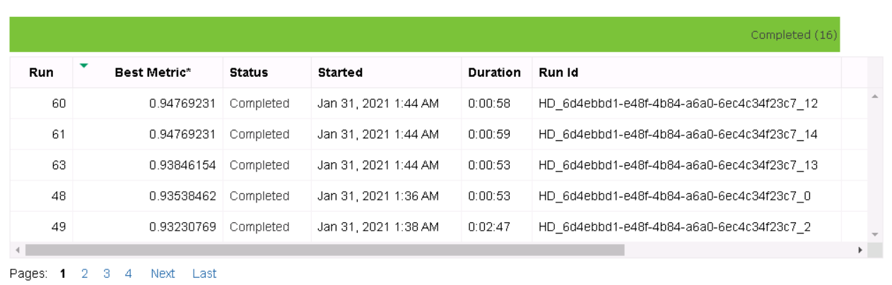

<!-- https://drive.google.com/file/d/1kYWbQPcjMp4z8cTCW0_ShrDLZsaOIy2u/view?usp=sharing -->
# E-Commerce Payment Fraud Detection

The world is getting more digitalized, and so do payments. Fraud in commerce is called "payment fraud" and is defined as any type of illegal or false transaction. The profit can be money, goods or even sensitive information. Since COVID-19 e-payment transactions amount has risen. According to the [Sift insights](https://blog.sift.com/2020/where-does-fraud-go-from-here-how-coronavirus/), the education space, travel and transportation are the most hot targets in this year. 

  

There are several tools on the market that are used to detect payment frauds, and all of them use artificial intelligence to do so. In this project there is an attempt to analyze a dataset and determine how well can fraudulent actions be recognized. 

## Dataset
When it comes to financial information, it is almost impossible to get data to perform research. After searching for information online, one dataset has been found. 

### Overview
The dataset contains transactions made by credit cards in September 2013 by european cardholders. The dataset contains anonymized credit card transactions labeled as fraudulent or genuine. The data has gone through a PCA transformation and therefore contains only numerical data. The data contains 32 columns which have been renamed as V1, V2, ... V28. The dataset can be found [here](https://www.kaggle.com/mlg-ulb/creditcardfraud).

The data is very unbalanced, as any dataset with fraud occurences. Data used in fraud detection in banking, real-time bidding in marketing or intrusion detection in networks [often have less than 1%](https://www.kdnuggets.com/2017/06/7-techniques-handle-imbalanced-data.html) of rare, but “interesting” events. There are multple ways to handle this problem. One of them is resampling - selecting equal amount of data for both classes - genuine and fraudulent transactions. Alternatively, the usage of ensembling methods is recommended.

### Task
Though it will be impossible to say which features play the biggest role in payment fraud detection since data is highly anonymized, but it still will be interesting to see which methods work the best, and whether there are some more distinctive features that determine the outcome. These learnings can be then used for the less anonymized data, when it gets accessible. 

The project is split into multiple steps: 

  

We will be training model using Automated ML and HyperDrive. The results will be compared and the best model deployed. 
At the final step we will test the model endpoint. 

### Access
Since this is a kaggle dataset, the data has been downloaded as a csv file and uploaded to the ML Azure environment. 
The csv file has then been uploaded to the Azure ML to the blob storage: 

  

  

By choosing the dataset and navigating to the Consume tab, you can see the usage details, which can be copied later on to the Python Script:

  

## Automated ML
To train our model with AutoML, we need to create an experiment first. Let's name it 'lab3-experiment'

  

Now we can read our dataset, and create a new compute cluster. Microsoft offers different virtual machines. We will select 'STANDARD_D2_V2' version. 

  

If we refer to the official Microsoft documentation, we will see:
*"D-series VMs are designed to run applications that demand higher compute power and temporary disk performance. D-series VMs provide faster processors, a higher memory-to-core ratio, and a solid-state drive (SSD) for the temporary disk. Dv3-series, Dv2-series, a follow-on to the original D-series, features a more powerful CPU. The Dv2-series CPU is about 35% faster than the D-series CPU."*

Since training a model requires a high compute power, this option matches our needs well. 

When configuring AutoML, at a minimum we need to define: 

- The task - values can be 'classification', 'regression', or 'forecasting'. In our case it's classification, since we want to distinguish between normal payments and payment fraud
- The primary metric - in our case it's accuracy, since it defines how well our model performs
- Training data - for this use case we use the creditcard data we have previously uploaded
- Label column name - the column that contains our classification result. In creditcard dataset this column is called "Class"
- Compute target - a machine to run our task. We will use the one we have created previously. 

Additionally, we have defined the experiment timeout, which is 30 minutes. This way we define how long, in minutes, our experiment should continue to run.
To perform a cross-validation, we needed to define the number, which is set to 5 as in most of the Microsoft examples. As a result, metrics are calculated with the average of the five validation metrics. 

Finally, we've submitted our experiment. 

  

When navigating to the experiment, it can be seen that the training is running

  

### Results
The experiment is completed

  

Upon the completion of the experiment, in the run details we can see how our models have perfomed, and which one has scored the best accuracy. As we can see, VotingEnsemble has slightly outperformed StackEnsemble model.

  

This accuracy can also be seen on the graphic. It seems that most of the methods perfomed almost equally well. 

  

Does this mean we have an ideal training model? Unfortunately, not. Though AutoML has worked on balancing our dataset, we must remember that from the very start it was highly imbalanced, which means we are lacking on the fraud examples. Therefore, any analysis will bring the high accuracy for this type of the dataset. At the same time, our experiment was not in vain, since if we check for parameters, we will see that the definitely meaningful features are V4 and V14.

  

This means, that there are important features, which can help to define a fraudful payment. 
By using the values from the confusion matrix, we can determine the true positive and true negative rates. 

  

After a quick math, we can say that: 

- The non-fraudulent transactions are recognized in 99.991558% of cases
- The fraudulent transactions are recognized in 78.658536% of cases, which is still a good result.

## Hyperparameter Tuning
First of all, we need to clean our data - by turning it from inbalanced to the balanced one. To do so, we have selected all fraudulent entries (which are 492 in total), and randomly selected 492 non-fraudulent ones. Out of these entries we have built a single dataset

  

As can be seen on the following generated image, the dataset is now balanced:

  

The results can now be stored in a csv file, which we call "prepared.csv".

  

Since our data is now balanced, for the Hyper Drive model we've used LogisticRegression with two configurazitation parameters:

- Regularization strength, which lies between 0.001 and 1. The lower the value is, the bigger is the impact.
- Maximal number of iterations, which lies between 30 and 250. 

These parameters are selected randomly, with the help of RandomParameterSampling.
For the termination policy the BanditPolicy was used. 

Starting our Hyper Drive, we can see the details with RunDetails widget:

  

### Results
Our experiment is now finished, and we can see that the best two runs have reached the same result, which is around 94.77% of accuracy. 

  

The following graphic gives a better overview of the performance of different runs:

  

  

  

We can now print the best model id: 

  

## Model Deployment
*TODO*: Give an overview of the deployed model and instructions on how to query the endpoint with a sample input.

## Screen Recording
*TODO* Provide a link to a screen recording of the project in action. Remember that the screencast should demonstrate:
- A working model
- Demo of the deployed  model
- Demo of a sample request sent to the endpoint and its response
